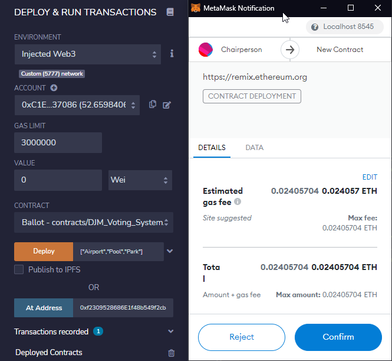

# Concur_SC
Concur is a Smart Contract on the Ethereum Blockchain. It enables users to agree on anything imaginable. It is secured by it's signaturies on the Ethereum Blockchain...where it lives immutably forevermore. 

Checkout our gSlides presentation [here](https://docs.google.com/presentation/d/1rih1TbxnlrEZVL_i3aZtN38MSt9jj_9ODyq0QfhbHfI/edit?usp=sharing). You will need to request permission from the owners via this link to see it.

---

## Technologies

Concur is written in the Solidity programming language and tested on the Ropsten Network. 

    Describe the technologies required to use your project such as programming languages, libraries, frameworks, and operating systems. Be sure to include the specific versions of any critical dependencies that you have used in the stable version of your project.

---

## Installation Guide

To compile and deploy Concur we used and tested with Remix and Metamask. We took data from our Bot and we provided the end user with a UI via IPFS. 

Please see code notes in the Solidity Contracts.

Note that the Voting System requires an array of strings for deployment.

---

## Examples

Checkout our YouTube Videos.

[Demo 1 - Short Demo (5 min) of the Voting System](https://www.youtube.com/watch?v=cDsFlOUtCto)

[Demo 2 - Longer Demo (10 min) of the Voting System](https://www.youtube.com/watch?v=2Pioc1-ETyg)

---

## Usage

    This section should include screenshots, code blocks, or animations explaining how to use your project.

---

---

## Useful Resources

[Ether.js](https://docs.ethers.io/v5/)
[Plotly](https://plotly.com/javascript/getting-started/#start-plotting)

## Contributors

Joe
Miguel
Dave

    In this section, list all the people who contribute to this project; since you may want to be reached by recruiters or potential collaborators, include your contact e-mail, and optionally your LinkedIn or Twitter profile.

---

## License

[MIT License](./LICENSE.TXT)

Copyright (c) [2021] [Joe, Miguel, Dave]

Permission is hereby granted, free of charge, to any person obtaining a copy
of this software and associated documentation files (the "Software"), to deal
in the Software without restriction, including without limitation the rights
to use, copy, modify, merge, publish, distribute, sublicense, and/or sell
copies of the Software, and to permit persons to whom the Software is
furnished to do so, subject to the following conditions:

The above copyright notice and this permission notice shall be included in all
copies or substantial portions of the Software.

THE SOFTWARE IS PROVIDED "AS IS", WITHOUT WARRANTY OF ANY KIND, EXPRESS OR
IMPLIED, INCLUDING BUT NOT LIMITED TO THE WARRANTIES OF MERCHANTABILITY,
FITNESS FOR A PARTICULAR PURPOSE AND NONINFRINGEMENT. IN NO EVENT SHALL THE
AUTHORS OR COPYRIGHT HOLDERS BE LIABLE FOR ANY CLAIM, DAMAGES OR OTHER
LIABILITY, WHETHER IN AN ACTION OF CONTRACT, TORT OR OTHERWISE, ARISING FROM,
OUT OF OR IN CONNECTION WITH THE SOFTWARE OR THE USE OR OTHER DEALINGS IN THE
SOFTWARE.
